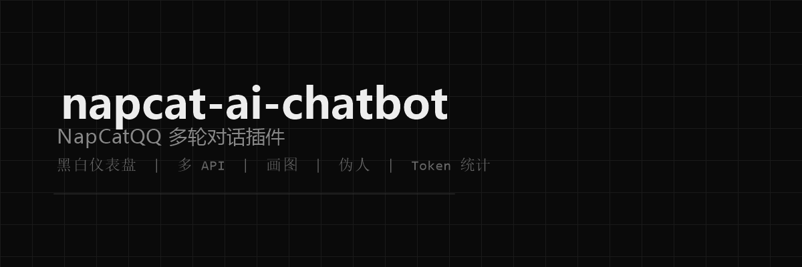
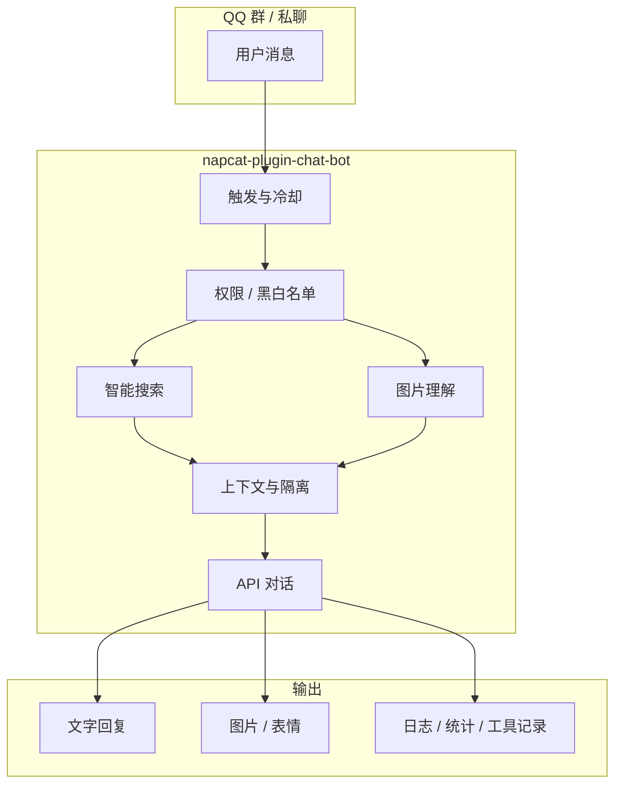
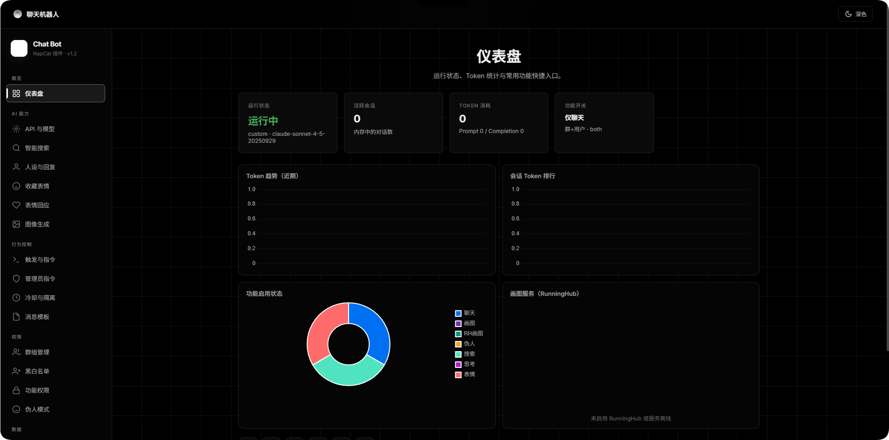
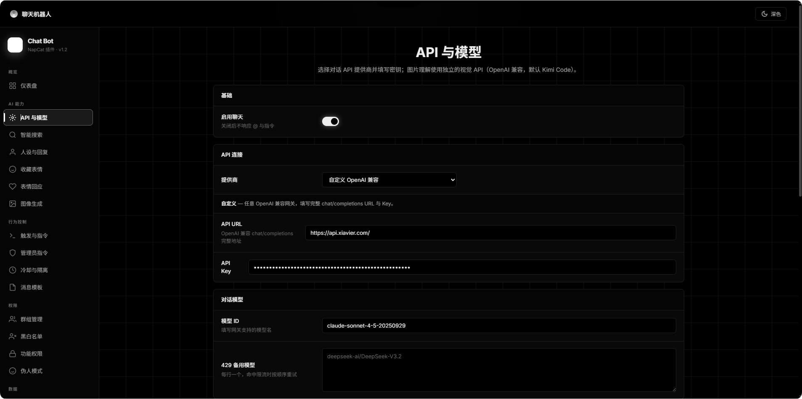
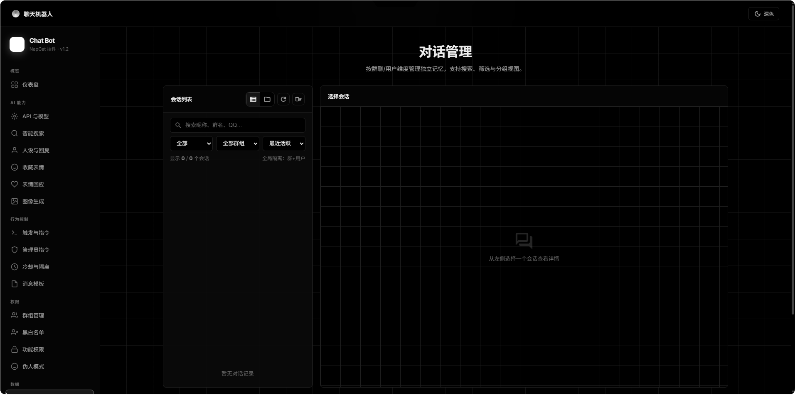
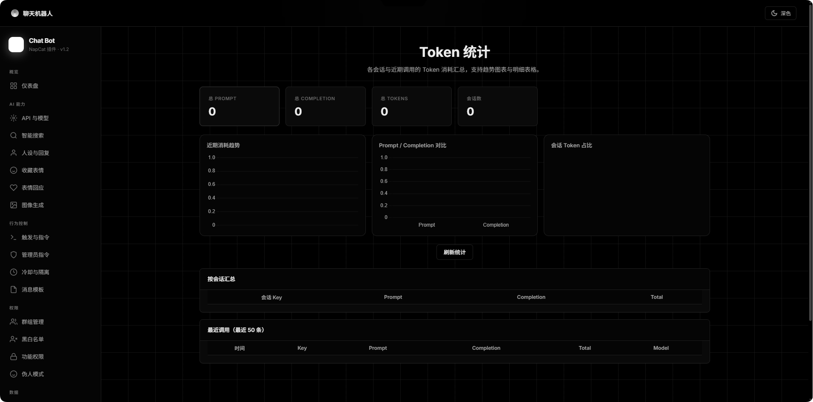
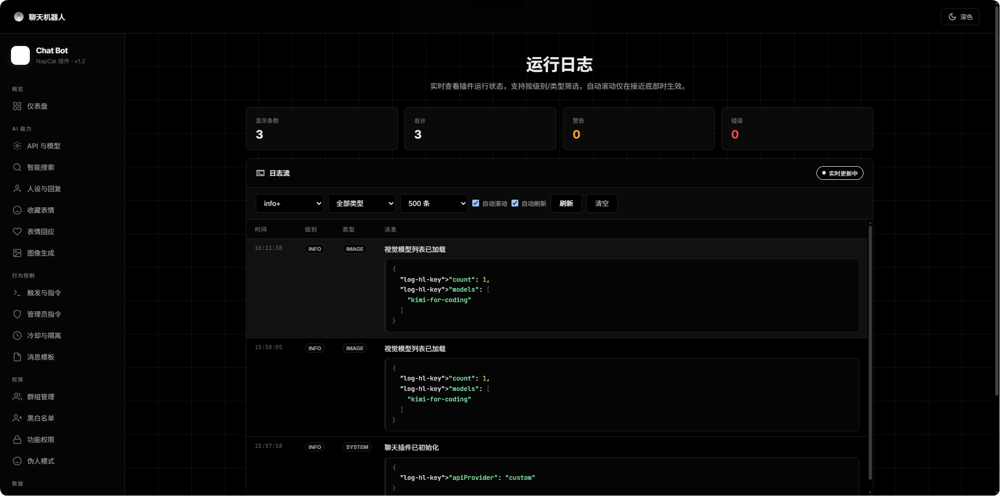
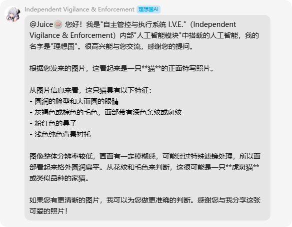

# napcat-ai-chatbot

NapCatQQ 多轮对话插件 · 智能搜索 · 黑白风 WebUI 仪表盘 · 多 API / 画图 / 伪人 / 热重载更新




---

## 简介

面向 [NapCatQQ](https://github.com/NapNeko/NapCatQQ) 的全功能聊天机器人插件。支持 @ 触发与自定义指令、多轮上下文与人设、群/用户黑白名单、联网智能搜索、图片理解与生成、伪人插话、表情回应，以及黑白极简风格的 **WebUI 仪表盘**（配置、统计、对话管理、运行日志、一键更新）。

> 当前版本：**v2.8.1** · 完整更新记录见仪表盘「更新日志」或 [CHANGELOG.md](CHANGELOG.md)

---

## 目录

- [功能一览](#功能一览)
- [快速开始](#快速开始)
- [WebUI 仪表盘](#webui-仪表盘)
- [智能搜索](#智能搜索)
- [API 与模型](#api-与模型)
- [更新与热重载](#更新与热重载)
- [开发调试（HMR）](#开发调试hmr)
- [配置说明](#配置说明)
- [管理员指令](#管理员指令)
- [目录结构](#目录结构)
- [常见问题](#常见问题)
- [相关链接](#相关链接)

---

## 功能一览

| 模块 | 能力 |
|------|------|
| **对话** | 多轮上下文、人设、冷却、@/指令/自定义触发、思考指示、回复后表情/戳一戳 |
| **API** | SiliconFlow / DeepSeek / 百炼 / Coding Plan / Kimi Code / 自定义 OpenAI 兼容；API 池故障转移 |
| **视觉** | 独立视觉 API（Kimi Code 等），图片理解后注入对话上下文 |
| **智能搜索** | 国内：B 站 / 抖音 / 博查 / 百度 / 阿里云等；国外：DuckDuckGo / Serper / Tavily；AI 生成搜索词 |
| **画图** | SiliconFlow / Gemini / RunningHub 本地服务、队列与管理员指令 |
| **伪人** | 群聊概率插话、AI/短句/表情混合、连续对话、联网搜索 |
| **对话管理** | 会话列表、气泡展示、**工具调用折叠框**（联网搜索 / 图片理解 / 画图） |
| **数据** | Token 统计图表、运行日志终端流、更新日志页 |
| **权限** | 群开关、黑白名单、按功能授权、对话隔离（群+用户 / 群 / 用户 / 全局） |
| **更新** | GitHub Release 检查安装、**45+ 国内镜像加速**、更新后自动热重载后端 |



---

## 快速开始

### 环境要求

| 项目 | 要求 |
|------|------|
| NapCat | **>= 4.14.0**（已在 **4.17.17** 测试） |
| Node.js | 随 NapCat 运行环境即可（插件为 ESM） |
| 网络 | 对话 API 需能访问对应服务商；国内建议配置镜像加速更新 |

### 安装方式

**方式一：GitHub Release（推荐）**

1. 打开 [Releases](https://github.com/SUSRDev/napcat-ai-chatbot/releases) 下载最新 `napcat-plugin-chat-bot-vX.Y.Z.zip`
2. 解压到 NapCat 插件目录，例如：`<NapCat>/plugins/napcat-plugin-chat-bot/`
3. 重启 NapCat，在插件列表启用 **聊天机器人**

**方式二：Git 克隆**

```bash
git clone https://github.com/SUSRDev/napcat-ai-chatbot.git
# 将仓库内容放入 plugins/napcat-plugin-chat-bot/
```

**方式三：仪表盘在线更新**

已安装旧版时，打开仪表盘 → **关于我们** → **检查更新** → **立即更新**（保留 `config.json`，更新后自动热重载）。

### 打开仪表盘

浏览器访问（将域名/端口换成你的 NapCat 地址）：

```
http://<你的NapCat地址>/plugin/napcat-plugin-chat-bot/page/dashboard
```

### 最小配置流程

1. **API 连接**：选择提供商（如 Kimi Code / SiliconFlow），填写 API Key 与模型
2. **联网搜索**（可选）：启用后选择「智能搜索（自动）」
3. **群组 / 黑白名单**：限制可用群与用户
4. 保存配置，群内 **@ 机器人** 或发送触发词（如 `/chat`）测试

---

## WebUI 仪表盘

侧边栏主要页面：

| 页面 | 说明 |
|------|------|
| 概览 | 运行状态、Token 图表、快捷指标 |
| API 连接 | 提供商、Key、模型、故障转移、高级采样 |
| 智能搜索 | 渠道、区域、搜索词模式、各平台 Key |
| 人设与触发 | 系统提示词、触发模式、冷却、回复前缀 |
| 群组与权限 | 群开关、黑白名单、对话隔离、管理员 |
| 对话管理 | 会话列表、气泡、工具调用折叠框 |
| 运行日志 | 终端流式日志，支持向下/向上滚动、自动刷新 |
| 更新日志 | 从 GitHub / 本地拉取 CHANGELOG，大日志流展示 |
| 关于我们 | 版本对比、镜像加速、一键更新、**热重载** |

### 预览图

#### 概览仪表盘



#### API 与对话管理

| API 配置 | 对话管理 |
|:---:|:---:|
|  |  |

#### Token 统计与运行日志

| Token 统计 | 运行日志 |
|:---:|:---:|
|  |  |

#### QQ 群内效果



---

## 智能搜索

v2.5.0 起默认渠道为 **智能搜索（自动）**，根据用户问题自动决定是否联网，并并行检索多个平台。

### 搜索渠道

| 渠道 | 说明 |
|------|------|
| `smart` | 自动判断国内/国外（中文 → 国内） |
| `smart-domestic` | 国内：B 站 API、抖音站内检索、博查、百度 AI、阿里云 IQS、UAPI、DuckDuckGo |
| `smart-international` | 国外：DuckDuckGo、Serper、Tavily、UAPI 等 |
| 单渠道 | 仍可单独选 DuckDuckGo / Serper / Tavily / 博查 / 百度 / 阿里云 |

### 搜索词模式

| 模式 | 行为 |
|------|------|
| **AI**（默认） | 先由 AI 判断是否需搜索并生成关键词；失败则用用户原话 |
| **固定** | 仅使用 `webSearchQuery` 固定词 |

> 注意：`webSearchQuery` **仅在固定模式下生效**，AI 模式不会混入固定词。使用 Kimi Code 时建议关闭「高级采样」，否则辅助 AI 调用可能因 `temperature` 参数报 400。

### 三路联合搜索

开启 `webSearchTriple` 后，AI 可一次生成 1～3 条搜索词分别检索后合并结果。

---

## API 与模型

### 支持的对话提供商

| 提供商 | 说明 |
|--------|------|
| SiliconFlow | 默认推荐，模型丰富 |
| DeepSeek | 官方 API |
| 百炼 (Bailian) | 阿里云百炼 |
| Coding Plan | 编码计划兼容接口 |
| **Kimi Code** | `kimi-for-coding`，自动附加 `User-Agent: KimiCLI/1.3` |
| 自定义 | 任意 OpenAI 兼容 `chat/completions` |

### Kimi Code 注意

- 对话与视觉可分别配置 Key / URL / 模型列表（`GET /kimi/models?scope=chat|vision`）
- 未开启「高级采样」时，主对话与辅助调用均不传 `temperature`，避免 400
- 403 多为缺 Agent 头；插件已自动处理

### API 池与故障转移

可在仪表盘配置多个 API 端点，按 429 / 5xx / 超时自动轮换，并支持自定义备用模型列表。

---

## 更新与热重载

### 仪表盘更新

1. **关于我们** → 检查更新 → 立即更新
2. 从 GitHub Release 下载 zip（可选国内镜像加速）
3. 覆盖插件文件（**保留 `config.json`**）
4. 自动调用 `PluginManager.reloadPlugin` 热重载后端
5. 仪表盘约 3 秒后自动刷新

若更新后新功能（如 `/changelog`、智能搜索）不生效，说明后端未重载成功：

- 点击 **热重载** 按钮，或
- NapCat 插件页手动重载本插件，或
- 调用 `POST /plugin/napcat-plugin-chat-bot/api/update/reload`

### 镜像加速

内置 45+ GitHub 下载镜像，支持自动测速选最快线路。在 **关于我们 → 镜像加速** 配置。

### 更新日志页

- 接口：`GET /changelog`
- 本地 `CHANGELOG.md` 版本不低于 GitHub 时 **优先展示本地**
- 徽章显示来源：`本地` / `GitHub` / 镜像名

---

## 开发调试（HMR）

本地开发可配合 NapCat 官方热重载，**无需每次重启 NapCat**。

### 前置条件

1. NapCat 安装并启用 [napcat-plugin-debug](https://github.com/NapNeko/napcat-plugin-debug)（默认 `ws://127.0.0.1:8998`）
2. 插件项目安装依赖：

```bash
cd napcat-plugin-chat-bot
pnpm install   # 或 npm install
```

### 常用命令

| 命令 | 说明 |
|------|------|
| `pnpm run push` | 构建 → 复制到 NapCat 插件目录 → 热重载 |
| `pnpm run dev` | watch 模式，保存即构建并热重载 |
| `pnpm run build` | 仅构建到 `dist/` |

远程 NapCat 开发请用 SSH 隧道转发 8998，**勿将调试端口暴露公网**：

```bash
ssh -L 8998:127.0.0.1:8998 user@your-server
set NAPCAT_DEBUG_WS=ws://127.0.0.1:8998   # Windows
export NAPCAT_DEBUG_WS=ws://127.0.0.1:8998 # Linux/macOS
```

详见 [NapCat 热重载文档](https://doc.napneko.icu/develop/plugin/hot-reload)。

### 发布（维护者）

本地使用 `scripts/release.py`（未纳入版本库，含 AI 生成 CHANGELOG、校验格式、打 tag、推 GitHub Release）。维护者自行保存该脚本与 `.release-local.json`（API Key）。

---

## 配置说明

### 核心配置项

| 类别 | 配置项 | 说明 |
|------|--------|------|
| API | `apiProvider` + `*ApiKey` | 当前使用的提供商与密钥 |
| 自定义 | `customApiUrl` + `customApiKey` | OpenAI 兼容网关 |
| 视觉 | `kimiVisionApiKey` / `kimiVisionApiUrl` | 图片分析，与对话 API 独立 |
| 搜索 | `webSearchEnabled` / `webSearchProvider` | 联网开关与渠道（默认 `smart`） |
| 搜索 | `smartSearchQueryMode` | `ai` / `fixed` |
| 搜索 | `webSearchRegion` | `auto` / `domestic` / `international` |
| 隔离 | `conversationIsolationMode` | `user_group` / `group` / `user` / `none` |
| 触发 | `triggerMode` | `at_only` / `command_only` / `both` / `custom` |
| 管理 | `adminUsers` + `adminCommandPrefix` | 默认 `#` 前缀管理员指令 |

配置文件路径：插件目录下 `config.json`（更新时自动保留）。

### 对话隔离模式

| 模式 | 说明 |
|------|------|
| `user_group` | 默认，每群每用户独立记忆 |
| `group` | 每群一份记忆 |
| `user` | 每用户一份记忆（跨群） |
| `none` | 群聊全局共享一份记忆 |

### 对话管理 · 工具调用记录

助手回复可展开查看本轮使用的工具：

- **联网搜索**：搜索词 + 完整检索结果
- **图片理解**：视觉模型分析文本
- **图片生成**：提示词 + 图片 URL

仅更新后新产生的对话带有 `tools` 元数据。

---

## 管理员指令

在 `adminUsers` 中的 QQ 号可在群内使用（默认前缀 `#`）：

| 指令 | 说明 |
|------|------|
| `#status` | 运行状态 |
| `#clear` | 清空当前会话 |
| `#cooldown` | 查看/设置冷却 |
| `#on` / `#off` | 临时开关 |
| `#draw-stats` | 画图统计 |
| `#draw-queue` | 画图队列 |
| `#draw-cancel` | 取消画图任务 |
| `#draw-promote` | 提升队列优先级 |
| `#draw-clear` | 清空画图队列 |
| `#draw-help` | 画图帮助 |
| `#help` | 指令列表 |

完整列表与消息模板在仪表盘对应页面配置。

---

## 目录结构

```text
napcat-plugin-chat-bot/
├── index.mjs                 # 插件入口（路由、对话、搜索、更新）
├── package.json
├── CHANGELOG.md
├── config.json               # 用户配置（更新时保留，勿提交仓库）
├── icon.png / icon.svg
├── webui/
│   └── dashboard.html        # WebUI 仪表盘（单页应用）
├── lib/
│   ├── draw-bot.mjs          # RunningHub 画图引擎
│   ├── image-gen.mjs         # 文生图多 API
│   ├── messages.mjs          # 消息模板
│   ├── smart-search.mjs      # 智能多平台搜索
│   ├── plugin-reload.mjs     # 热重载（PluginManager + debug WS）
│   ├── self-update.mjs       # GitHub Release 更新
│   └── github-mirrors.mjs    # 下载镜像测速
├── vite.config.mjs           # 开发构建 + HMR 部署
├── scripts/
│   └── hmr-stub.mjs          # Vite 构建占位入口
└── docs/
    └── images/               # README 预览图
```

---

## 常见问题

### 更新后新功能不生效（如更新日志 404、智能搜索无效）

**原因**：只更新了 `dashboard.html`，`index.mjs` 仍在内存中运行旧代码。

**解决**：仪表盘 **热重载**，或 NapCat 插件页重载本插件。以后用「立即更新」会自动热重载。

### 联网搜索无结果 / 搜索词为空

1. 确认已启用联网搜索，渠道选「智能搜索」
2. 搜索词模式选 **AI**，勿依赖空的固定搜索词
3. Kimi Code 用户：关闭「高级采样」
4. 查看运行日志：应有 `智能搜索开始` 而非 `query: ""`

### 更新日志显示版本旧于当前安装版本

本地 `CHANGELOG.md` 比 GitHub 新时，v2.5.5+ 会优先显示本地。若仍显示 GitHub 旧内容，请热重载后端或更新到最新版。

### 运行日志「向下更新」但新日志在顶部

v2.5.0+ 已修复排序逻辑，请更新 `dashboard.html` 并刷新页面。

### `stadium.js` 控制台报错

来自浏览器扩展，与插件无关，可忽略或用无痕模式验证。

### Kimi 对话 403 / 400

| 状态码 | 常见原因 |
|--------|----------|
| 403 | 缺 `KimiCLI/1.3` User-Agent（插件已自动添加） |
| 400 | 未开高级采样却传了 `temperature`（v2.5.2+ 已修复辅助调用） |

---

## Star History

<a href="https://www.star-history.com/?repos=SUSRDev%2Fnapcat-ai-chatbot&type=date&legend=top-left">
 <picture>
   <source media="(prefers-color-scheme: dark)" srcset="https://api.star-history.com/chart?repos=SUSRDev/napcat-ai-chatbot&type=date&theme=dark&legend=top-left" />
   <source media="(prefers-color-scheme: light)" srcset="https://api.star-history.com/chart?repos=SUSRDev/napcat-ai-chatbot&type=date&legend=top-left" />
   
 </picture>
</a>

如果这个项目对你有帮助，欢迎点个 Star 支持开发。

---

## 相关链接

| 链接 | 说明 |
|------|------|
| [GitHub 仓库](https://github.com/SUSRDev/napcat-ai-chatbot) | 源码与 Release |
| [NapCatQQ](https://github.com/NapNeko/NapCatQQ) | 机器人框架 |
| [NapCat 插件开发](https://doc.napneko.icu/develop/plugin) | 官方文档 |
| [热重载（HMR）](https://doc.napneko.icu/develop/plugin/hot-reload) | 开发调试 |
| [表情回应 API](https://napcat.apifox.cn/226659104e0) | `set_msg_emoji_like` |

---

## License

[MIT](LICENSE)
