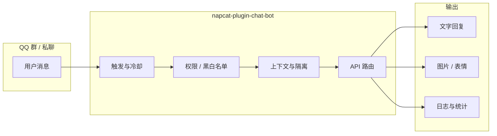
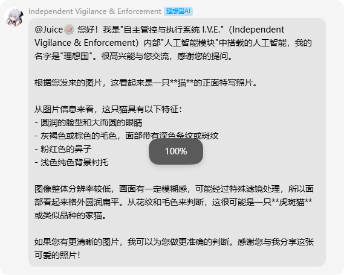

<p align="center">
  
</p>

<p align="center">
  <strong>napcat-ai-chatbot</strong><br />
  NapCatQQ 多轮对话插件 · 黑白风 WebUI 仪表盘 · 多 API / 画图 / 伪人 / 对话隔离
</p>

<p align="center">
  <a href="#功能一览">功能</a> ·
  <a href="#快速开始">快速开始</a> ·
  <a href="#webui-预览">预览</a> ·
  <a href="#star-history">Star History</a> ·
  <a href="#配置说明">配置</a> ·
  <a href="#截图素材指南">素材指南</a>
</p>

<p align="center">
  
  
  
</p>

---

## 简介

面向 [NapCatQQ](https://github.com/NapNeko/NapCatQQ) 的聊天机器人插件：支持 @ 触发与指令触发、多轮上下文、人设与冷却、群/用户黑白名单、管理员运维指令，以及一套 **黑白极简** 风格的 WebUI 仪表盘。

- 不包含任何内置 API Key，密钥由用户在仪表盘或 `config.json` 中自行填写
- 旧版 `xiaviercodex` 提供商已移除，已有配置会自动迁移到「自定义 OpenAI 兼容」

---

## Star History

> 将下方链接中的 `YOUR_USERNAME` 替换为你的 GitHub 用户名，推送仓库后即可显示 Star 增长曲线。  
> 在线编辑与对比：[star-history.com](https://www.star-history.com/)

<p align="center">
  <a href="https://star-history.com/#YOUR_USERNAME/napcat-ai-chatbot&Date">
    
  </a>
</p>

<details>
<summary>多仓库对比（可选）</summary>

将多个仓库用逗号拼接，例如与同类插件对比 Star 走势：

```text
https://api.star-history.com/svg?repos=YOUR_USERNAME/napcat-plugin-chat-bot,OTHER_USER/other-plugin&type=Date
```

</details>

---

## 功能一览

| 模块 | 能力 |
|------|------|
| 对话 | 多轮上下文、人设、冷却、触发词、思考指示、表情回应 |
| API | SiliconFlow / DeepSeek / 百炼 / Coding Plan / 魔搭 / 自定义 OpenAI 兼容 |
| 视觉 | 独立视觉 API（默认 Kimi Code 兼容接口，可替换） |
| 搜索 | 多提供商联网搜索（Serper、Tavily、博查等） |
| 画图 | SiliconFlow / Gemini / RunningHub 本地服务、队列与管理员指令 |
| 伪人 | 群聊概率插话、AI/短句/表情混合、连续对话 |
| 数据 | 对话管理、Token 统计图表、运行日志（语法高亮） |
| 权限 | 群开关、黑白名单、按功能授权、对话隔离模式 |



---

## 快速开始

### 环境要求

- NapCat **>= 4.14.0**
- Node.js 随 NapCat 运行环境即可（插件为 ESM）

### 安装

```bash
# 克隆仓库（请将 YOUR_USERNAME 换成你的 GitHub 用户名）
git clone https://github.com/YOUR_USERNAME/napcat-plugin-chat-bot.git

# 放入 NapCat 插件目录，例如：
# <NapCat>/plugins/napcat-plugin-chat-bot/
```

重启 NapCat 后，在插件列表中启用 **聊天机器人**。

### 打开仪表盘

```
/plugin/napcat-plugin-chat-bot/page/dashboard
```

1. **API 与模型**：选择提供商并填写你自己的 API Key  
2. **图片理解**（可选）：填写视觉 API Key 与 URL  
3. **群组 / 黑白名单**：按需限制可用范围  
4. 保存配置后即可在群内 @ 机器人或发送触发词测试  

---

## WebUI 预览

> 以下图片路径已预设。请将截图放入 `docs/images/`，详见 [截图素材指南](#截图素材指南) 与 [docs/IMAGES.md](docs/IMAGES.md)。

### 概览仪表盘

黑白网格背景、Token 趋势与功能状态一览。

<p align="center">
  
</p>

### API 与对话管理

<p align="center">
  
  &nbsp;
  
</p>

### Token 统计与运行日志

图表动画 + JSON 语法高亮日志流。

<p align="center">
  
  &nbsp;
  
</p>

### QQ 群内效果

<p align="center">
  
</p>

---

## 截图素材指南

请按此表准备图片并保存到 **`docs/images/`**（文件名必须一致）：

| 文件名 | 放什么 | 怎么截 |
|--------|--------|--------|
| `banner.png` | 顶部横幅 | 1200x400，纯文字 + 黑底网格风（已内置，可自选替换） |
| `screenshot-dashboard.png` | 概览页 | 仪表盘 -> 概览，含卡片与图表 |
| `screenshot-api.png` | API 页 | API 与模型，**Key 打码** |
| `screenshot-conversations.png` | 对话管理 | 会话列表 + 可选右侧详情 |
| `screenshot-tokens.png` | Token 统计 | 三张图表 + 统计卡片 |
| `screenshot-logs.png` | 运行日志 | 带彩色 JSON 高亮的日志列表 |
| `screenshot-chat.png` | QQ 群聊 | 实际触发对话，**隐私打码** |

**操作步骤**

1. 浏览器打开仪表盘，使用深色主题  
2. `Win + Shift + S` 框选（或 macOS `Cmd + Shift + 4`）  
3. 导出 PNG，重命名为上表文件名  
4. 复制到 `docs/images/`  
5. 推送 GitHub 后，把 README 里两处 `YOUR_USERNAME` 改成你的用户名  

更详细的尺寸与 Star History 说明见 **[docs/IMAGES.md](docs/IMAGES.md)**。

---

## 配置说明

### 主要配置项

| 类别 | 配置项 | 说明 |
|------|--------|------|
| API | `apiProvider` + 对应 `*ApiKey` | 仅使用当前提供商的 Key |
| 自定义 | `customApiUrl` + `customApiKey` | OpenAI 兼容网关 |
| 视觉 | `kimiVisionApiKey` / `kimiVisionApiUrl` | 图片分析，与对话 API 独立 |
| 隔离 | `conversationIsolationMode` | `user_group` / `group` / `user` |
| 管理 | `adminUsers` + `adminCommandPrefix` | 群内 `#status`、`#clear` 等 |

### 管理员指令示例

| 指令 | 说明 |
|------|------|
| `#status` | 运行状态 |
| `#clear` | 清空对话 |
| `#draw-stats` | 画图统计 |
| `/draw-queue` | 查看画图队列 |

完整列表与模板在仪表盘 **管理员指令**、**消息模板** 页配置。

### 目录结构

```text
napcat-plugin-chat-bot/
├── index.mjs              # 插件入口
├── package.json
├── webui/
│   └── dashboard.html     # WebUI 仪表盘
├── lib/
│   ├── draw-bot.mjs       # RunningHub 画图
│   ├── image-gen.mjs      # 文生图
│   └── messages.mjs       # 消息模板
└── docs/
    ├── IMAGES.md          # 图片与 Star History 详细说明
    └── images/            # README 截图与 banner（由你添加）
```

---

## 相关链接

- [NapCatQQ](https://github.com/NapNeko/NapCatQQ)
- [Star History](https://www.star-history.com/) — Star 增长曲线图
- [NapCat set_msg_emoji_like 文档](https://napcat.apifox.cn/226659104e0)

---

## License

[MIT](LICENSE)
