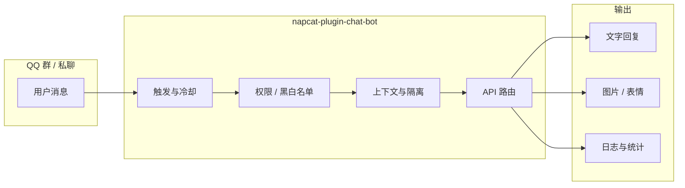

# napcat-ai-chatbot

NapCatQQ 多轮对话插件 · 黑白风 WebUI 仪表盘 · 多 API / 画图 / 伪人 / 对话隔离


---

## 简介

面向 [NapCatQQ](https://github.com/NapNeko/NapCatQQ) 的聊天机器人插件：支持 @ 触发与指令触发、多轮上下文、人设与冷却、群/用户黑白名单、管理员运维指令，以及黑白极简风格的 WebUI 仪表盘。

---

## Star History

[](https://star-history.com/#SUSRDev/napcat-ai-chatbot&Date)

---

## 功能一览

| 模块 | 能力 |
|------|------|
| 对话 | 多轮上下文、人设、冷却、触发词、思考指示、表情回应 |
| API | SiliconFlow / DeepSeek / 百炼 / Coding Plan / 魔搭 / 自定义 OpenAI 兼容 |
| 视觉 | 独立视觉 API（默认 Kimi Code 兼容接口，可替换） |
| 搜索 | 多提供商联网搜索（Serper、Tavily、博查等） |
| 画图 | SiliconFlow / Gemini / RunningHub 本地服务、队列与管理员指令 |
| 伪人 | 群聊概率插话、AI/短句/表情混合、连续对话 |
| 数据 | 对话管理、Token 统计图表、运行日志（语法高亮） |
| 权限 | 群开关、黑白名单、按功能授权、对话隔离模式 |



---

## 快速开始

### 环境要求

- NapCat **>= 4.14.0**（已在 **4.17.17** 测试通过）
- Node.js 随 NapCat 运行环境即可（插件为 ESM）

### 安装

```bash
git clone https://github.com/SUSRDev/napcat-ai-chatbot.git
# 放入 NapCat 插件目录，例如：<NapCat>/plugins/napcat-plugin-chat-bot/
```

重启 NapCat 后，在插件列表中启用 **聊天机器人**。

### 打开仪表盘

```
/plugin/napcat-plugin-chat-bot/page/dashboard
```

1. **API 与模型**：选择提供商并填写 API Key
2. **图片理解**（可选）：填写视觉 API Key 与 URL
3. **群组 / 黑白名单**：按需限制可用范围
4. 保存配置后即可在群内 @ 机器人或发送触发词测试

---

## WebUI 预览

### 概览仪表盘


### API 与对话管理

| API 配置 | 对话管理 |
|:---:|:---:|
|  |  |

### Token 统计与运行日志

| Token 统计 | 运行日志 |
|:---:|:---:|
|  |  |

### QQ 群内效果


---

## 配置说明

### 主要配置项

| 类别 | 配置项 | 说明 |
|------|--------|------|
| API | `apiProvider` + 对应 `*ApiKey` | 仅使用当前提供商的 Key |
| 自定义 | `customApiUrl` + `customApiKey` | OpenAI 兼容网关 |
| 视觉 | `kimiVisionApiKey` / `kimiVisionApiUrl` | 图片分析，与对话 API 独立 |
| 隔离 | `conversationIsolationMode` | `user_group` / `group` / `user` |
| 管理 | `adminUsers` + `adminCommandPrefix` | 群内 `#status`、`#clear` 等 |

### 管理员指令示例

| 指令 | 说明 |
|------|------|
| `#status` | 运行状态 |
| `#clear` | 清空对话 |
| `#draw-stats` | 画图统计 |
| `/draw-queue` | 查看画图队列 |

完整列表与模板在仪表盘 **管理员指令**、**消息模板** 页配置。

### 目录结构

```text
napcat-plugin-chat-bot/
├── index.mjs              # 插件入口
├── package.json
├── webui/
│   └── dashboard.html     # WebUI 仪表盘
├── lib/
│   ├── draw-bot.mjs       # RunningHub 画图
│   ├── image-gen.mjs      # 文生图
│   └── messages.mjs       # 消息模板
└── docs/
    └── images/            # README 预览图
```

---

## 相关链接

- [仓库](https://github.com/SUSRDev/napcat-ai-chatbot)
- [NapCatQQ](https://github.com/NapNeko/NapCatQQ)
- [Star History](https://www.star-history.com/)
- [NapCat set_msg_emoji_like 文档](https://napcat.apifox.cn/226659104e0)

---

## License

[MIT](LICENSE)
